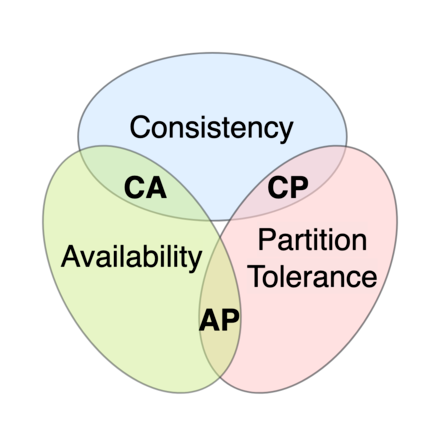
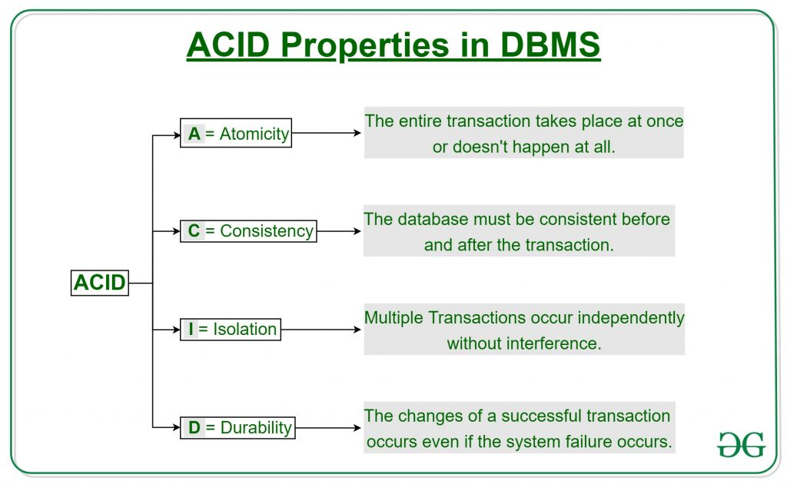

## exercise 1

CAP (you can have 2 of the 3, when there are partiitons):

- consistency - Every read receives the most recent write or an error.
- availability - Every request receives a (non-error) response, without the guarantee that it contains the most recent write
- partition tolerance - The system continues to operate despite an arbitrary number of messages being dropped (or delayed) by the network between nodes.

- CA - (problematic, non existent). "Not partition torelant" but if there is no partitions, all of the 3 things in CAP are fulfilled.
- CP - after partitioning if we have a request, we might have updated the value somewhere else and we return an error/wait message
- AP - (most used) after partitioning, we always return something although it might not be the right answer. We return the morst recent answer we have had saved.

## Exercise 2 - ACID

A - if 3 transactions are in 1 actiion, all 3 will be executed or none. In SQL you have rollback operations if anything goes wrong you revert the successful changes,
NoSQL just leaves the result if the failure occurs.

C - in DB you will never have a hanging foreign key because of the failed transaction. SQL has this, noSql (document storage) does not, for better performance.

I - transactions inside operations will never overlap. they execute concurrently.

D - allows you to write efficiently in bathces. If there is a crash inside a batch you lose a current batch.

## Exercise 3

1. Could lose durability because we are gettting a lot of data
2. none are crucial
3. depends who you ask
4. dont sacrifice data quality
5. not much data = no big costs

## Exercise 4

1. mongo
2. mod the n
3. rehashing -> modulo -> +1
4.
5.
6. Chord
