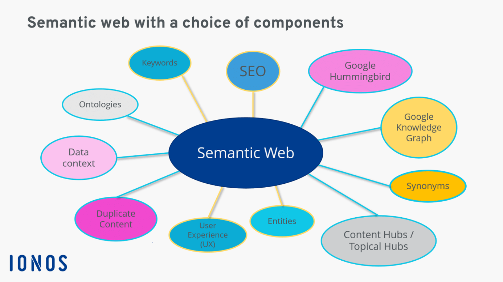
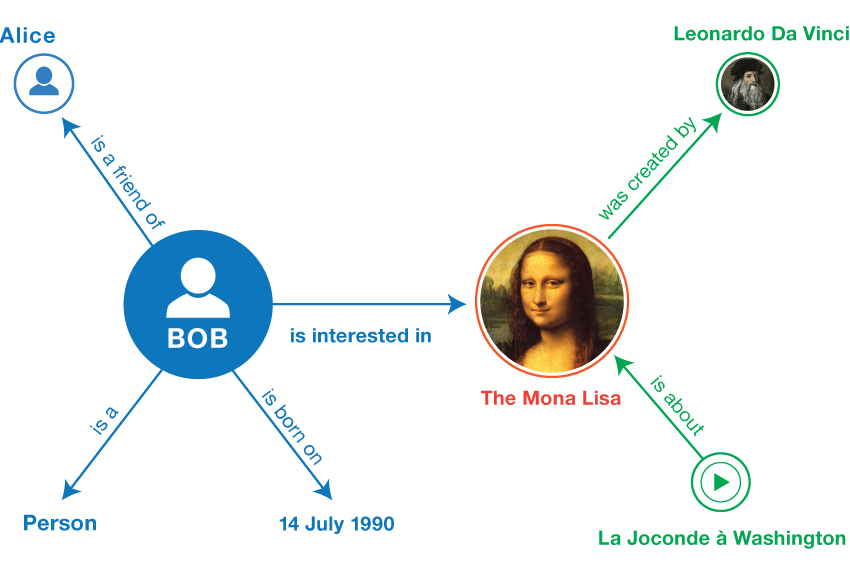

# Cassandra

We have a concept of tables - mean something else though.  
The closest DB that is noSWL but still feels like SQL.
MEant to work on multiple machines - hence noSQL.
One node is coordinator.

## Exercise 1

### Question 1.1

CQL  
2 concepts:

- partitions:
- replicas

#### Partitions

(Geographichal) distibution of the instances.  
Partitioning key & clustering keys

1. Partition key - does not need to be unique. Can have multiple nodes with Munich as city and if you select Munich, you would get many instances with Munich data.
2. Clustering key - also does not need to be unique.

Together, they should be unique

#### Replicas

Replicas of data to achieve fault tolerance.  
By setting the number of replicas, Casandra takes care of the setup and everything.

### Question 1.2

When Casandra works on 1 row, everything is guaranteed. Otherwise not.

#### Atomicity

Rollback on error, when only 1 row is modified.  
Tunable consistency - determine how you want to determine, when the write is successful.  
Options:
quarum - majority of nodes (replicas) need to agree
all - all need to agree

#### Consistency

In cap (voting mechanism) and acid sense. Has tunable consistency setting. For reads and write. 1,2,3,quorum,all.  
Serial/linearizable consistency.

**Quorum** is achieved, when set number of reads + set number of writes > ALL nodes, Quorum is reached.

#### Isolation

Within machine ("on row level") - YES
Between machine - no way to achieve isolated writes.

#### Durability

You want speed - you dont write to the disk all the time.

1. writes the change directly to memory
2. writes the change to `change log` (every so often apply them to disk)

When restarting machine, you know what commit you stopped at and continue from there.  
Faster, because commit change log uses sequential, not random access write and actually submitting each change. Changes are applied in memory.

### Question 1.3

Scale out strategy - Cassandra uses "CHORD"

### Question 1.4

Not a problem. TODO explanation

## Exercise 2

3 tables:  
User (UserID, name)
Friend (UserID, FriendID, name)
Follower (UserID, FollowerID, name)

friendID and followerID should be in partition key so they reside on the same machine, when we query it.

## Exercise 3

1. Replicas are partitions which just replicate the data of a certain node.
2. Read write combination 1-all, all-1, quorum-all, all-quorum, quorum-quorum.

## Exercise 4


The Semantic Web is a vision about an extension of the existing World Wide Web, which provides software programs with machine-interpretable metadata of the published information and data. In other words, we add further data descriptors to otherwise existing content and data on the Web.


The Resource Description Framework (RDF) is a general framework for representing interconnected data on the web. RDF statements are used for describing and exchanging metadata, which enables standardized exchange of data based on relationships. RDF is used to integrate data from multiple sources.

SPARQL, pronounced 'sparkle', is the standard query language and protocol for Linked Open Data on the web or for RDF triplestores. SPARQL, short for “SPARQL Protocol and RDF Query Language”, enables users to query information from databases or any data source that can be mapped to RDF.

### Question 1

In SparQL you don't write Munchen but a reference to it (wd:Q1726).

Make a variable: ?a

```Sparql
SELECT ?a ?b
WHERE {
  ?a ?b wd:Q1726
}
```

?a ?b wd:Q1726
object, predicate, X?

```
SELECT (count(?a) as ?count) ?b
WHERE {
  ?a ?b ?c
}
GROUP BY ?b
ORDER BY desc(?count)
```

3. Transitive subclasses (all subclasses of subclasses)

4. lang is a qualifier (for the further description) for name
